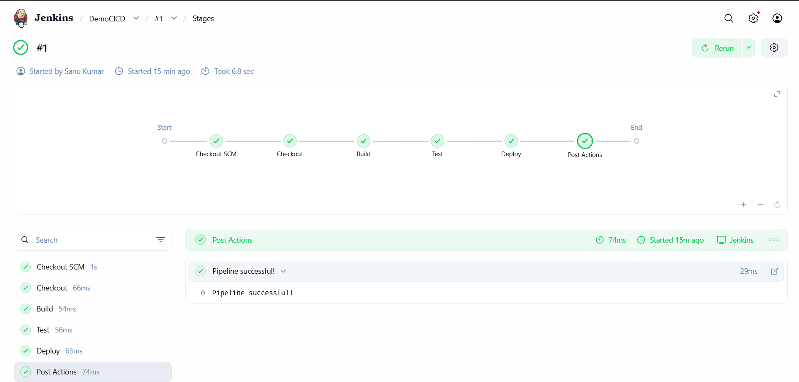
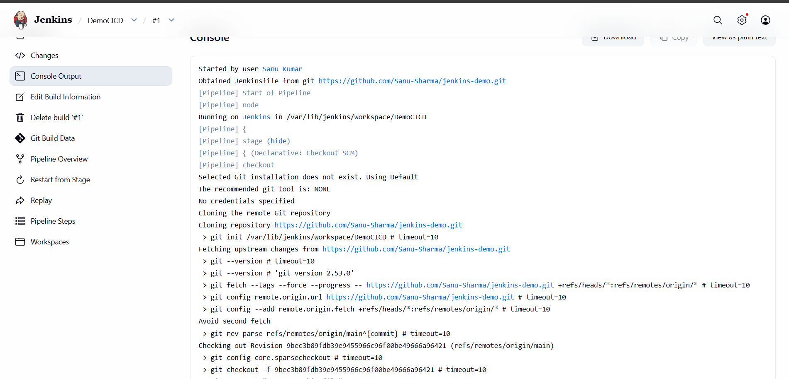

# Jenkins Notes 🚀

## What is Jenkins?
Jenkins is an open-source automation server used to automate
building, testing, and deploying applications — the heart of CI/CD!

---

## 🎯 Freestyle Job

A Freestyle Job is the simplest type of Jenkins job.
You can configure it using the Jenkins UI without writing any code.

### Steps to Create Freestyle Job
1. Click **"New Item"** in Jenkins
2. Enter job name
3. Select **"Freestyle Project"**
4. Click **OK**
5. Add build steps (Execute shell, etc.)
6. Click **Save** and **Build Now**

### Example Shell Command in Freestyle Job
```bash
echo "Hello Guys"
echo "Like, Share, Subscribe"
mkdir -p devops
echo "DevOps folder created"
```

---

## ⚙️ Declarative Pipeline

A Jenkins Pipeline is a set of automated steps to build, test, and deploy code.

```groovy
pipeline {
    agent any
    stages {
        stage('Build') {
            steps {
                echo 'Building the application...'
            }
        }
        stage('Test') {
            steps {
                echo 'Running tests...'
            }
        }
        stage('Deploy') {
            steps {
                echo 'Deploying to server...'
            }
        }
    }
}
```

## Pipeline Stages Explained

- **agent any** — Run the pipeline on any available Jenkins agent
- **stage('Build')** — Compile the source code
- **stage('Test')** — Run automated tests
- **stage('Deploy')** — Deploy application to the server

- ---

## 🔧 Practical Demo — GitHub + Jenkins Integration

### ✅ Pipeline Successfully Run!

**Stages completed:**
- ✅ Checkout SCM
- ✅ Build
- ✅ Test
- ✅ Deploy
- ✅ Post Actions — Pipeline Successful!

## Tech Stack


## 📸 Screenshots

### Pipeline Stages


### Console Output

